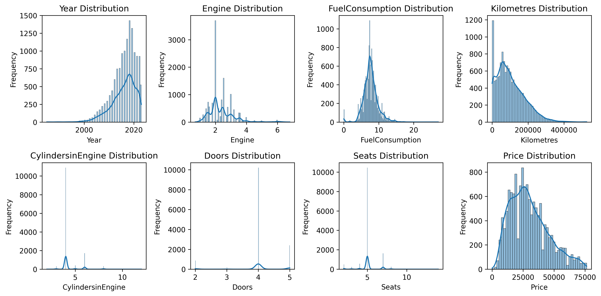
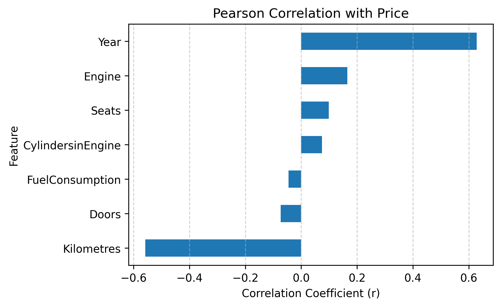
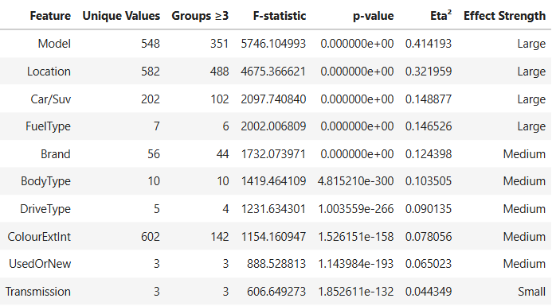

# 🚗 Australian Vehicle Prices Analysis with Genetic Algorithm Feature Selection

This project applies **data preprocessing, statistical analysis**, and **feature selection using a Genetic Algorithm (GA)** to the **Australian Vehicle Prices dataset (2023)**.
The main goal is to identify the most influential factors affecting vehicle prices in Australia and build a robust predictive model.

This repository demonstrates **feature selection using a Genetic Algorithm (GA)** and predictive modeling on the **Australian Vehicle Prices dataset (2023)**. The goal is to identify the most influential features affecting car prices in Australia and build a predictive model.

---

## 📌 Project Overview

This project applies a **Genetic Algorithm (GA)** to automatically select the most relevant features for predicting **vehicle prices in Australia (2023)**.
It combines **data preprocessing, statistical analysis**, and **evolutionary feature optimization** to identify the key factors influencing vehicle prices and to build a high-performing predictive model.


The workflow:
- **Preprocesses** raw vehicle data (handling missing values, encoding categorical features, scaling numeric data).
- **Analyzes** statistical relationships between features and price using **correlation** (for numeric) and **ANOVA-based** tests (for categorical).
- **Optimizes** feature selection using a **Genetic Algorithm (GA)** powered by the `DEAP` library.
- **Evaluates performance** with a `RandomForestRegressor` through cross-validation (scored by Negative Mean Squared Error).
- **Visualizes results**, including GA evolution progress and feature importance.
- **Compares** model performance using all features vs. the GA-selected subset.


🧠 Summary:
The project demonstrates how evolutionary computation can enhance traditional feature selection, uncovering feature combinations that improve predictive performance beyond what standard statistical analysis reveals.

---

## 📈 Workflow Summary

- Download dataset from **Kaggle** → save it to the `data/` folder.

- `data_cleaning.py` → generates cleaned data file in `data/` folder.

- `data_analysis.py` → produces analysis visuals and statistical results in the `result/` folder.

- `genetic_algorithm.py` → identifies the optimal feature subset and final model **using any cleaned dataset**.

---

## 🧩 Project Structure
 <details><summary><b>➕ 1. Data Cleaning</b></summary>

- Loads and preprocesses the raw dataset. The dataset has 18 features and 1 target.

  - Features: `Brand`, `Year`, `Model`, `Car/Suv`, `Title`, `UsedOrNew`, `Transmission`, `Engine`, `DriveType`, `FuelType`, `FuelConsumption`, `Kilometres`, `ColourExtInt`, `Location`, `CylindersinEngine`, `BodyType`, `Doors`, `Seats`.

  - Target: `Price`.

- Drops `Title`, that is the combination of some other features.

- Converts categorical variables to numeric form when possible: `Price`, `Engine`, `FuelConsumption`, `Kilometres`, `CylindersinEngine`, `Doors`, `Seats`.

- Handles missing values, duplicates, and outliers (outliers just  in `Price`).

- Saves the cleaned dataset to be used in the next steps.
</details>

<details><summary><b>➕ 2. Statistical data Analysis</b></summary>

- Generates **histograms with KDE curves** for all `numeric columns`.

  

- Computes Pearson Correlation Coeficient between Price and each other numeric feature.

  

  The first visualization shows that most numerical features deviate from a normal distribution, while the second illustrates the strength and direction of each feature’s linear relationship with vehicle price.
  Higher absolute values of `Pearson_r` indicate stronger relationships, while the very low `p_value` (implemented in code) values confirm that these correlations are statistically significant.

- Performs **normality** and **variance homogeneity** checks for each `categorical feature`.

  - **Shapiro–Wilk test** → evaluates whether the data within each category follow a normal distribution.

  - **Levene’s test** → assesses whether category variances are equal (homogeneity of variances).

- Depending on these assumptions, applies the appropriate **statistical test** to determine how each categorical feature influences vehicle price:

  - **ANOVA** → used when data are normally distributed with equal variances.

  - **Welch’s ANOVA** → used when data are normal but variances are unequal.

  - **Kruskal–Wallis** → used when data deviate from normality.

- **Statistical definitions**:

  - **Null hypothesis (H₀)**: All group means of `Price` are equal.

  - **Alternative (H₁)**: At least one group mean differs.

  - **F-statistic**: Ratio of between-group variance to within-group variance, measuring group separability.

  - **p-value**: Probability of observing the calculated statistic under H₀. A smaller value indicates stronger evidence against H₀.

  - **Effect size (η², eta squared)**: Proportion of the total variance in `Price` explained by that categorical feature.

  

- Interpreting the Results:

  - **Statistical analysis** (Pearson correlation, ANOVA, η²) measures **direct, individual relationships** between each feature and the target `price`.

  - A **p-value ≈ 0** indicates that there is a statistically significant difference in the average car price across the unique categories of each feature.

  - Numeric analysis highlights features with strong linear relationships (`Year`, `Kilometres`).

  - Categorical analysis highlights features with large group effects (`Model`, `Location`, `Car/SUV`, `FuelType`).

  - **These methods <ins>assume independence</ins> and do not account for interactions or combined effects between features.** So the difference in price might be partly or mostly due to other correlated variables. 

  - **Genetic Algorithm (GA) feature selection**, on the other hand, evaluates **subsets of features together** using model performance. It may select features that individually seem weaker but **improve predictive accuracy when combined** with others features. It can capture **nonlinear effects and interactions** that classical statistical tests cannot detect.

- Key takeaway:

  - Statistical analysis identifies features with **strong individual effects**.

  - GA identifies a **synergistic subset** that optimizes predictive performance.

  - Differences are not contradictions — they highlight the complementary strengths of **explanatory vs. predictive approaches**.


</details>


<details> <summary><b>➕ 3. Genetic Algorithm</b></summary>

Implements a Genetic Algorithm using the DEAP library for feature selection.

Uses RandomForestRegressor as the fitness evaluator (based on cross-validated Negative MSE).

Evolves multiple feature subsets through selection, crossover, and mutation.

Visualizes GA progress (fitness vs. generations).

Outputs the best feature subset, model performance, and feature importances.
</details>

---

## 📊 GA key Features

- 🔍 **Automatic Feature Selection:** Uses a GA to evolve and find the most predictive combination of features.
- ⚙️ **Sklearn Pipelines:** Handles preprocessing (scaling, encoding, and missing data) automatically per feature subset.
- 🌲 **Random Forest Model:** Robust regression model with `n_estimators=20`, `max_depth=6`, and `n_jobs=-1` for parallel computation.
- 📈 **Model Evaluation:** Cross-validation using `neg_mean_squared_error` ensures reliable fitness scoring.
- 🧬 **GA Configuration:**
  - Selection: selBest (`k=10`)
  - Crossover: Two-point (`cxTwoPoint`, probability = 0.7)
  - Mutation: Bit-flip (`mutFlipBit`, probability = 0.3)
  - Fitness: Higher is better (maximizing −MSE)
- 🧩 **Data Reduction:** Groups categorical features with only 1–2 unique values into `__OTHER__` to simplify the dataset and enhance model efficiency.
- 📊 **Visualization Outputs:**
  - `1_ga_convergence.png` — GA convergence curve  
  - `2_featue_selection_frequency.png` — Feature selection frequency per generation  
  - `3_comparison_performance_mse.png` — All vs GA (MSE comparison)  
  - `4_comparison_performance_r2.png` — All vs GA (R² comparison)  
  - `5_comparison_predicted_vs_actual.png` — Predicted vs actual prices  
  - `6_feature_importance.png` — Aggregated feature importance from the final model
- 💡 **Interpretability:** Aggregates one-hot encoded feature importances back to the original feature names for a clear impact summary.
- 🏆 **Best Features:** Selected based on the highest fitness achieved across all generations.

---

### 🧠 Why This Project Matters

This approach demonstrates how **evolutionary algorithms** can be combined with **machine learning pipelines** to:
- Automatically identify key predictive features.
- Improve model generalization.
- Provide explainable insights into which attributes (e.g., Year, DriveType, Engine, Kilometres) most influence car prices.

---


## 📦 Dataset

The dataset used in this project is the **Australian Vehicle Prices Parsing (2023)** dataset published by **Nidula Elgiriyewithana** on Kaggle.

> ⚠️ **Note:** The dataset is **not included** in this repository due to license restrictions.  
> You can download it directly from Kaggle:

🔗 [**Dataset on Kaggle**](https://www.kaggle.com/datasets/nelgiriyewithana/australian-vehicle-prices)  
📘 **DOI:** [10.34740/kaggle/dsv/7062095](https://doi.org/10.34740/kaggle/dsv/7062095)

---

💡 **Tip:**  
You can use **any dataset of your own** with the code `genetic_algorithm.py` — just in two conditions:

- Data is clean.

- Make sure that **the last column is the target variable** (e.g., `Price`), and all other columns represent features.

---


## 🧩 Requirements

To run this project, you’ll need Python **3.8+** and the following Python packages:

- for data_analysis.py: 

  `numpy` `pandas` `scipy` `matplotlib` `seaborn` `statsmodels` 

  To install the Python dependencies, run:

  ```bash
  pip install pandas numpy scipy matplotlib seaborn statsmodels
  ```
- for genetic_algorithm.py:

  `numpy` `pandas` `scikit-learn` `deap` `matplotlib` `seaborn` `argparse`

  ```bash
  pip install numpy pandas scikit-learn deap matplotlib seaborn
  ```


You can find the complete list of required libraries in the `requirements.txt` file.

---


## 🚀 How to Run

This project is organized into three main scripts that should be run in **sequence** from the **command line**. The third file can be run separately.

1️⃣ Data Cleaning — `data_cleaning.py`

  The original Kaggle dataset must be downloaded and saved in the `data/` folder.

  Run:
  ```bash
  python python data_cleaning.py
  ```

  A cleaned dataset saved in `data/` folder.

2️⃣ Statistical Data Analysis — `data_analysis.py`
  Run:
  ```bash
  python data_analysis.py
  ```
  Statistical plots and summary tables saved in the `result/` folder.

3️⃣ Genetic Algorithm Feature Selection — genetic_algorithm.py

  The script requires **three input arguments**:

  1- `data` → Path to your dataset file (`.csv`)

  2- `--n_generations` → Number of generations to run in the Genetic Algorithm

  3- `--pop_size` → Population size per generation. 

  Run:

  ```bash
  python script.py [CSV_DATASET] [--n_generations] [--pop_size]
  ```
  For example:
  ```bash
  python genetic_algorithm.py data/australian_vehicle_prices_cleaned.csv --n_generations 8 --pop_size 12
  ```
  This command will:

  1- Load the dataset from the specified path.

  2- Run the Genetic Algorithm for 8 generations with a population of 12 individuals.

  3- Print the best fitness score per generation, and the final selected features.

  4- Train the final model using those selected features.

  5- Generate and save all the plots in `result/` folder (feature_importance.png).

  🧠 Tip:

  For large datasets, increasing `--pop_size` or `--n_generations` improves search accuracy but increases runtime. Use moderate values like `--n_generations 10` `--pop_size 20` for balanced performance.

  The results stored in the `result/` folder were obtained by running the Genetic Algorithm with **40 generations** and a **population size of 12** (`--n_generations 40` `--pop_size 12`).

  


